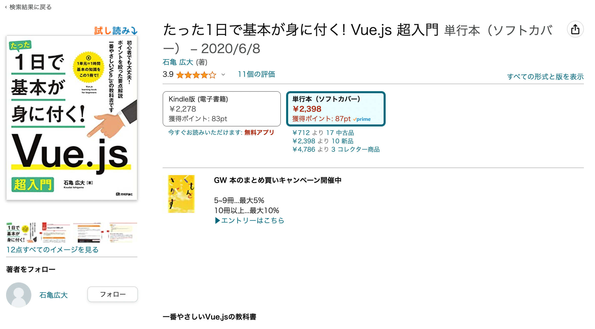

# 説明資料

## 目次

- 自己紹介
- 展示の概要
- 展示の内容
- 技術的な概要
- 提案内容

## 自己紹介

- 石亀広大（いしがめ こうだい）
    - 経歴
        - 八戸工業高校 情報技術科（今は無い？）
        - 八戸工業大学 システム情報工学科 2017年3月卒
        - 都内のITベンチャーで４年半ほどフロントエンドエンジニアとして勤務
        - 独立してカメラマン、プログラマ、カフェの共同経営
- 書籍執筆

## 展示の概要

[2023/12 個展 [ Melt The Border ]](meta.md)

## デジタルアートの内容（仮）

- 美術館ギャラリーの壁にプロジェクターやカメラ・マイク等を使って壁に映し出す
    - 音声によってリアルタイムで反応する流体シュミレーション（デモあり）
    - カメラで顔や腕の動きなどを機械学習等で観測して、それらの座標系入力値で反応する模様やアニメーション
    - その他、、、

## 技術的な概要

- 使っている技術
    - WebGL（GLSL）, Three.js, React.js, Vite,
    - デプロイ先（未定）: 静的サイトホスティングでできたら一番良さそう
- 開発ツール
    - Github, Slack, VSCode（エディタはなんでも良い）, Notionかgoogle docsか

## 提案内容

- 機械学習を使ってカメラ内に映った人の顔や腕の動きなどの認識
    - Tensorflow.jsなどを使って実装？
- 流体シミュレーションやその他シェーダーを使ったジェネレーティブアート
- オーディオビジュアライザー
- その他、、、

※・・・基本的には、物理的な何かしらの入力値を使ってリアルタイムで反応するものが望ましい